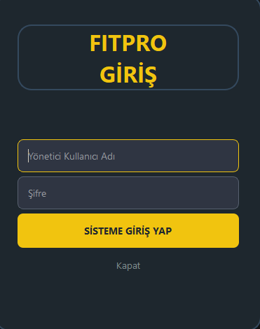
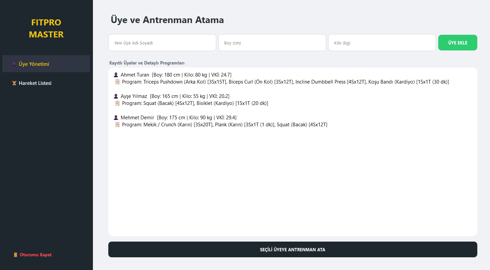
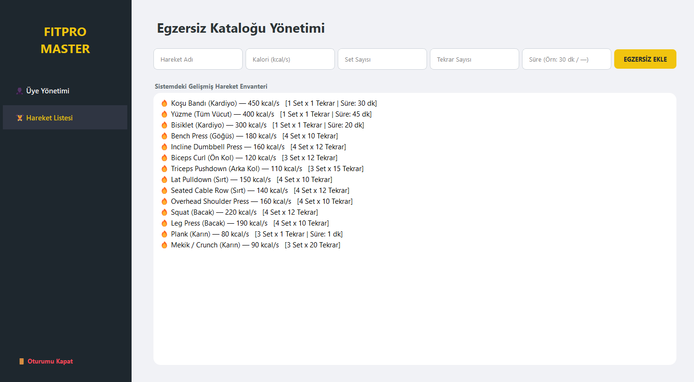

# 🏋️‍♂️ FitPro | Gelişmiş Spor Aktivite ve Üye Takip Sistemi

FitPro, spor salonları, kişisel eğitmenler (PT) veya bireysel gelişim takibi yapmak isteyen kullanıcılar için tasarlanmış; üye profillerini, detaylı vücut kitle indekslerini (VKİ) ve antrenman/egzersiz planlamalarını uçtan uca yöneten **Python & PyQt5** tabanlı modern bir masaüstü otomasyonudur.

Gelişmiş yerel veritabanı mimarisi (SQLite3) sayesinde tüm sporcu verilerini, kalori değerlerini ve antrenman setlerini yerelde güvenli ve performanslı bir şekilde saklar.

---

## ✨ Öne Çıkan Özellikler

* 🔒 **Yetkili Giriş Paneli:** Antrenörler ve salon yöneticileri için şık, güvenli ve karanlık tema odaklı kimlik doğrulama ekranı.
* 👥 **Akıllı Üye Yönetimi & VKİ Hesaplama:**
    * Üyelerin ad, boy ve kilo bilgilerini sisteme kaydetme.
    * Sisteme girilen boy ve kilo parametreleri üzerinden **Vücut Kitle İndeksini (VKİ)** otomatik hesaplama ve kaydetme altyapısı.
* 🏃‍♂️ **Gelişmiş Egzersiz & Kalori Kütüphanesi:**
    * Yeni hareket tanımlama (Egzersiz adı ve yakılan kalori bilgisi).
    * Egzersizlere özel **Set Sayısı**, **Tekrar Sayısı** ve **Süre (Dakika)** bilgilerini dinamik olarak işleme.
* 💾 **Güvenli SQLite Altyapısı:** Program ilk kez çalıştırıldığında `uyeler` ve `sporlar` tablolarını içeren `fitpro_v3.db` veritabanı dosyasını otomatik olarak oluşturur.
* 🎨 **Premium UI/UX Tasarımı:** Canlı renk kontrastları, özel QSS (Qt Style Sheets) arayüz kodlamaları ve kullanıcıyı yormayan dinamik liste tasarımları.

---

## 📸 Ekran Görüntüleri

### 1. Yetkili Giriş Ekranı
Sisteme sadece yetkili antrenörlerin erişmesini sağlayan, merkezi konumlandırılmış şık arayüz.
> **Varsayılan Giriş Bilgileri:** `Kullanıcı Adı: admin` | `Şifre: admin`



---

### 2. Sporcu Üye Listesi ve VKİ Paneli
Kayıtlı sporcuların listelendiği, boy, kilo ve sistem tarafından otomatik hesaplanan Vücut Kitle İndeksi (VKİ) değerlerinin yer aldığı ana panel.



---

### 3. Antrenman ve Egzersiz Yönetim Merkezi
Antrenman programlarının oluşturulduğu; hareket adı, kalori, set, tekrar ve süre parametrelerinin yönetildiği operasyon ekranı.



---

## 🛠️ Kullanılan Teknolojiler

* **Programlama Dili:** Python 3.x
* **Arayüz Çatısı (GUI):** PyQt5 (QWidgets, QStackedWidget, QListWidget, QInputDialog)
* **Veritabanı:** SQLite3 (İlişkisel yerel veritabanı yönetim sistemi)

---

## 🚀 Kurulum ve Çalıştırma

Projeyi yerel bilgisayarınızda çalıştırmak için aşağıdaki adımları takip edebilirsiniz:

### 1. Depoyu Klonlayın
```bash
git clone [https://github.com/kullanici-adi/FitPro.git](https://github.com/kullanici-adi/FitPro.git)
cd FitPro
